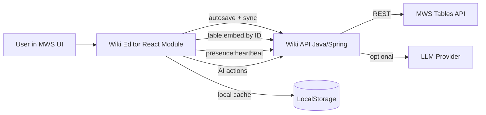

# Component & Integration Scheme

## Обязательный контур
1. In-line автосохранение: debounce + PUT `/api/pages/{id}`.
2. Локальный кэш: `localStorage` c восстановлением после reload.
3. Backlinks: серверный расчет входящих ссылок `[[page:id]]`.
4. Slash-menu + hotkeys: `/` + `Ctrl+/`.
5. Совместная работа (проверяемый вид): presence heartbeat, список активных пользователей на странице.
6. Вставка таблицы: `[[table:id]]` + запрос на `/api/tables/embed`.
